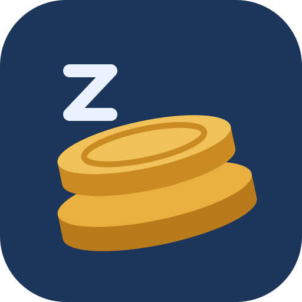

<p align="center">
  
</p>

<h1 align="center">lazy-koins</h1>

<p align="center">
  Crypto tax documents for Switzerland — from your exchange and wallet exports to a statement
  your tax office and your accountant can work with.
</p>

<p align="center">
  <a href="https://buymeacoffee.com/oldjazjef">☕ Buy me a coffee</a>
</p>

---

## What it is

**lazy-koins** turns the exports of crypto exchanges and wallets into the documents you need for
one tax year:

- **Wealth at 31 December** — every position per platform and wallet, valued in CHF (the
  _Steuerwert_ for the securities list / _Wertschriftenverzeichnis_).
- **Income of the year** — interest, earn, staking, airdrops, launchpools, hard forks, valued in
  CHF at the time they arrived.
- **A simple and a detailed statement** as PDF and Excel, ready to hand in or to send to your
  accountant (_Treuhänder_).

The first country is **Switzerland, private assets**: capital gains are tax-free there, so
lazy-koins does not compute them — it focuses on what has to be declared.

> lazy-koins is not tax advice. It documents how every figure was calculated so that you, your
> accountant or the tax office can check it.

## Why

Exchanges export their data in very different shapes, some income never shows up in the
transaction history at all (e.g. Binance Earn), and the valuation rules (ESTV rate list first,
then market prices at the right date and FX rate) are tedious to apply by hand. Doing this in
spreadsheets every year is error-prone. lazy-koins makes the process repeatable:
**same data in, same numbers out**, and every number can be traced back to the row of the file it
came from.

## How it works

1. **Create a project** for a tax year (e.g. "Steuern 2025"). A follow-up project for the next
   year can take over files, wallets and corrections.
2. **Upload your exports** (CSV, XLSX, PDF statements). Original files are stored unchanged and
   de-duplicated by their SHA-256.
3. **Files are read through a mapping.** There is no hard-coded parser per exchange: every format
   is described by a small, declarative **mapping JSON** (columns, date format, time zone, signs,
   fees, booking kinds, asset names). Mappings belong to you and work across all your projects —
   a file with the same columns is recognised automatically next time. You can
   - fill in the downloadable **standard template** (CSV/Excel) yourself,
   - write or edit a mapping in the app with a live preview, or
   - let an **AI provider of your choice** (OpenAI-compatible incl. local Ollama / LM Studio, or
     Anthropic) draft the mapping from a few sample rows — you see exactly what is sent and review
     the result before it is saved. PDF account statements can be read into balances the same way.
4. **Wallets** (Bitcoin incl. xpub, EVM chains via Etherscan, Solana, …) are fetched automatically
   where public APIs allow; everything else can be entered manually with a receipt.
5. **Rates** come from the ESTV rate list (downloaded automatically) and, where an asset is not
   listed, from daily market prices and ECB FX rates. Every rate shows its source and can be
   overridden.
6. **Calculate.** Positions, income, one-off events and checks are computed by a pure,
   deterministic engine. Click any amount to see the bookings behind it and the file and row they
   came from.
7. **Review checks and hints** — e.g. ledger balance vs. statement, missing files, income without
   a source, positions without a price — fix them with corrections (each with a reason, history
   and undo).
8. **Export** the statements (PDF/Excel with real formulas), send them to your accountant by mail
   from the app, and keep track of what was sent when.

## Two ways to run it

|           | Web app                             | Desktop app                                                     |
| --------- | ----------------------------------- | --------------------------------------------------------------- |
| Users     | many, each sees only their own data | one, no login                                                   |
| Data      | on the server (SQLite)              | only on your computer (a folder you choose, also a sync folder) |
| Platforms | any browser                         | Windows and macOS                                               |

Both run the **same code and the same calculation**; a project can be moved between them as a
package. Desktop installers are attached to every
[GitHub release](https://github.com/oldjazjef/lazy-koins/releases) (unsigned for now — Windows
SmartScreen / macOS Gatekeeper will ask once).

## Privacy

- Your files never leave your machine in the desktop app.
- The AI plugin is optional and off by default. When it is used, only a short sample (header and
  a few rows) is sent, after you saw it and agreed.
- API keys (AI, CoinGecko, Etherscan, mail) are stored encrypted and never shown again.
- Seed phrases and private keys are detected and refused — lazy-koins only ever needs public
  addresses.
- The assistant chat sends your messages and what its tools read for them to your AI provider —
  you agree once; it never changes anything before you click "Ausführen" on its proposal.

## AI assistant and MCP server

With the AI plugin set up, a **chat sidebar** (toggle in the header) explains figures with links
down to the file row, asks for missing files with an upload drop zone, and proposes corrections
as cards you confirm or cancel. Its system prompt is editable under Einstellungen › AI; the
safety rules (confirm before changes, no tax advice, no keys) are always appended.

The same tools are available to external AI clients (Claude Desktop, Claude Code, …) through a
built-in **MCP server** — off by default:

1. Einstellungen › MCP: switch it on, choose the areas (projects, files, results, …) and whether
   write tools are allowed, create a personal access token (shown once).
2. Connect a client to the Streamable HTTP endpoint `/api/mcp` with
   `Authorization: Bearer <token>`, e.g. Claude Code:
   `claude mcp add --transport http lazy-koins https://<your-host>/api/mcp --header "Authorization: Bearer <token>"`.
3. Desktop app: the endpoint only listens on 127.0.0.1 (the port changes per start), so use the
   **stdio** entry `mcp-stdio.js` that ships with the app — Einstellungen › MCP shows the exact
   command for your installation (it runs the app's executable with `ELECTRON_RUN_AS_NODE=1`
   and the token in `LAZYKOINS_MCP_TOKEN`).

Every tool call (chat and MCP) is logged without secrets and listed under Einstellungen › MCP;
tokens can be revoked at any time. For a quick check from a terminal:
`LAZYKOINS_MCP_TOKEN=… node scripts/dev/mcp-client.mjs http://localhost:3333/api/mcp`.

## Tech stack

An Nx monorepo: **Angular** (standalone, zoneless, spartan.ng, Tailwind CSS) for the app,
**NestJS** with **Prisma** and **SQLite** for the API, a pure TypeScript **engine** library
(decimal.js — no floating point for money) shared by both, **Electron** for the desktop app,
**Vitest** for tests. Details for contributors are in [CLAUDE.md](CLAUDE.md); the functional
requirements (German) in [ANFORDERUNGEN.md](ANFORDERUNGEN.md) and the tax rules in
[docs/FACHREGELN.md](docs/FACHREGELN.md).

## Getting started (development)

Requirements: Node 22 and pnpm 11 (pinned in `package.json`).

```bash
pnpm install
cp apps/api/.env.example apps/api/.env
pnpm db:deploy
pnpm db:seed
pnpm start:full
```

Open http://localhost:4200 and sign in with `anna@lazykoins.dev` (development mode, no password).

```bash
pnpm check          # lint, format, tests, build — the same gate as CI
pnpm start:desktop  # run the desktop app
pnpm build:desktop  # build the installer for your OS
```

## Support

If lazy-koins saves you an afternoon of spreadsheets, you can
[buy me a coffee](https://buymeacoffee.com/oldjazjef). Bugs and ideas are welcome as
[issues](https://github.com/oldjazjef/lazy-koins/issues); security problems please via
[private vulnerability reporting](SECURITY.md).

## License

[MIT](LICENSE) © Emanuel Mistretta
